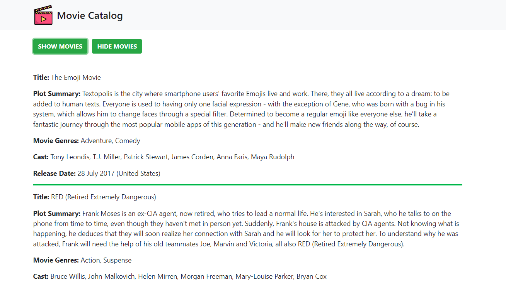

# Movie Catalog 

This project is a simple movie catalog created with the purpose of implementing asynchronous requests with JavaScript and XMLHTTPRequest (AJAX). The movie list file is coded in XML and the script XMLtoJSON converts the XML file to JSON notation before displaying the movie list when requested.

## Screenshot

## Technology Stack

The project was built with:

+ JavaScript
+ AJAX
+ XML
+ HTML
+ CSS
+ Bootstrap

